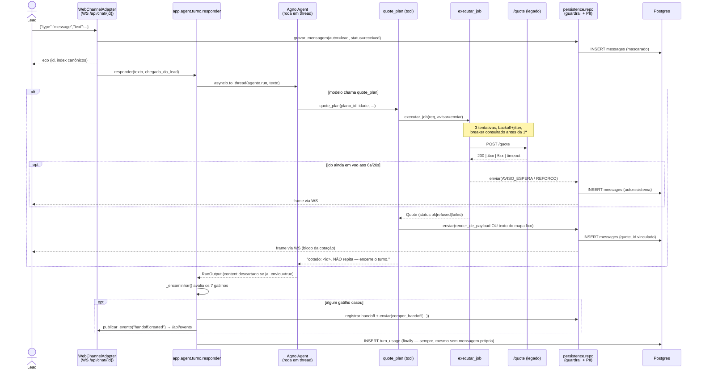
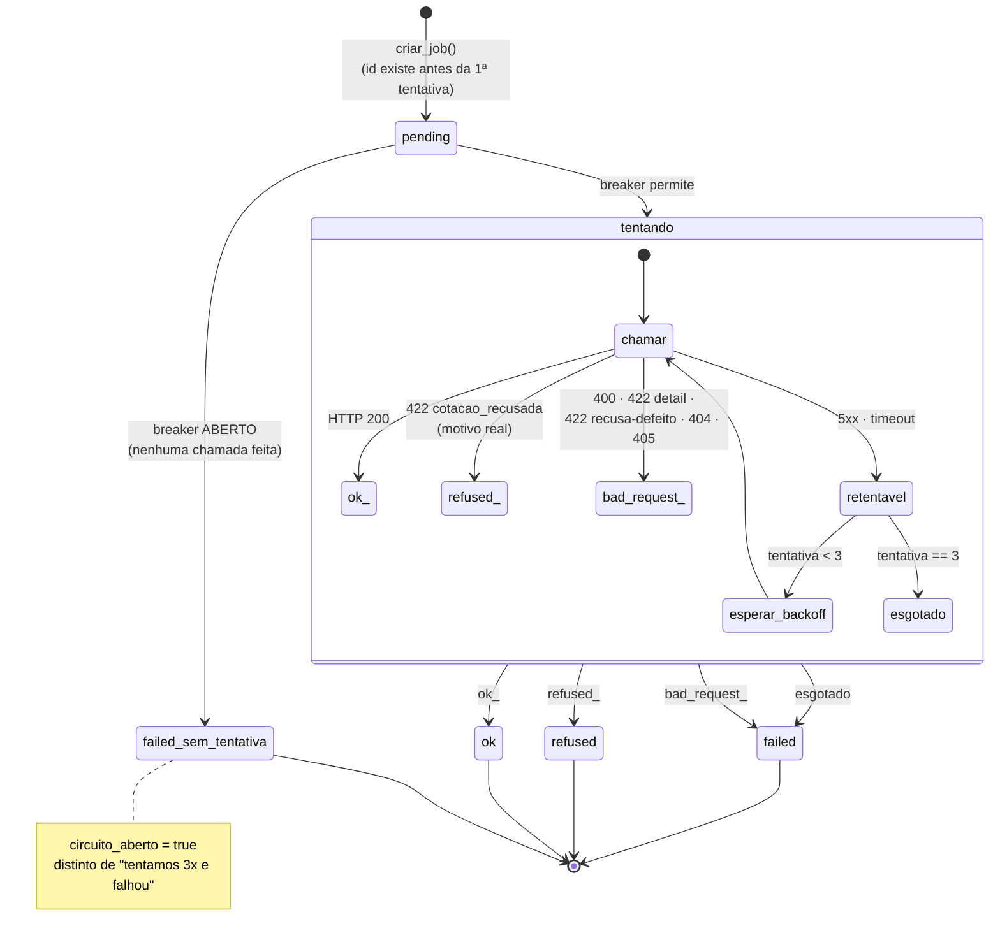
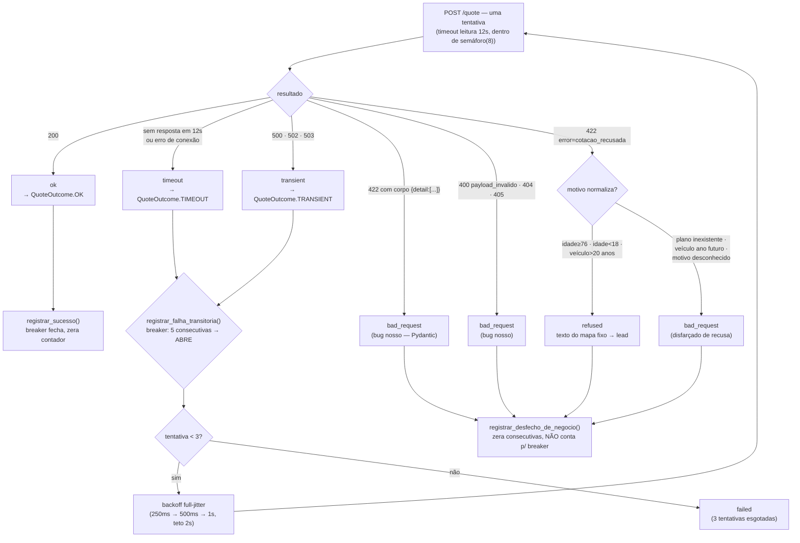
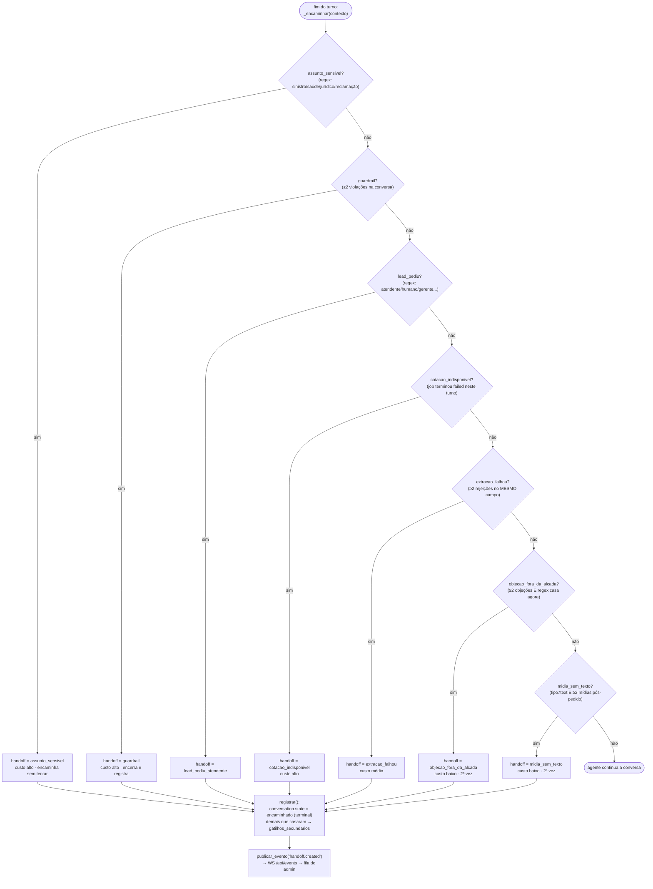
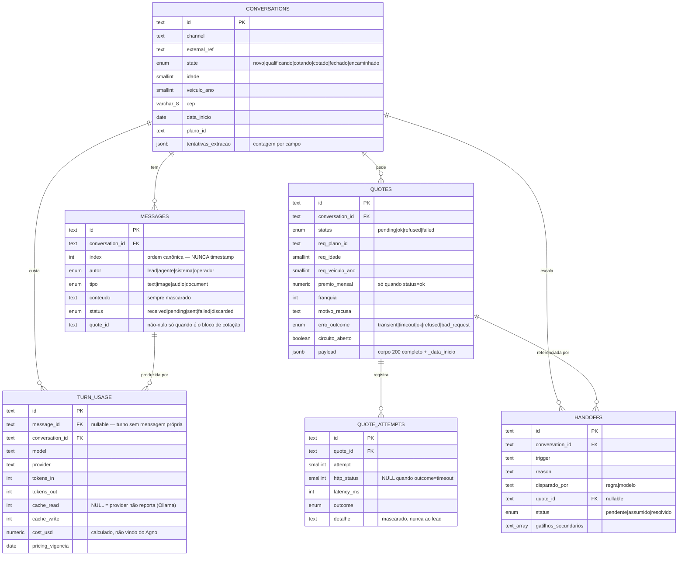

# Arquitetura

Mapa de módulos, contratos internos e os cinco diagramas que o README promete. Este
documento é **dev-friendly**: para o porquê de cada decisão, `README.md` e
`docs/DECISOES-FECHADAS.md`; para a medição que justifica cada número de resiliência,
`docs/POLITICA-RESILIENCIA.md` e `docs/API-COTACAO.md`.

Todo diagrama aqui foi conferido linha a linha contra o código que existe hoje —
não contra a descrição dele. Onde a implementação diverge de uma decisão documentada
em outro lugar, isso está dito explicitamente, não escondido atrás de um diagrama
bonito.

---

## 1 · Mapa de módulos

```
app/
├── main.py              # rotas HTTP, montagem do FastAPI, SPA estático
├── auth.py               # login opcional (ADMIN_USER/PASSWORD) + ADMIN_TOKEN
├── bootstrap.py           # falha alta no boot se faltar ANTHROPIC_API_KEY
├── config.py              # Settings — todo limiar numérico, com a medição no comentário
├── conversa.py            # Conversa: 1 turno por vez + relógio de 10s (demora do modelo)
├── ratelimit.py           # token bucket em memória, por origem
├── textos.py              # os 10 textos determinísticos (docs/TEXTOS.md)
│
├── agent/
│   ├── agente.py          # construir_agente(): model-string, prompt caching Anthropic
│   ├── catalogo.py        # busca GET /planos uma vez, cacheia no processo
│   ├── guardrail.py       # 3 verificações no ponto de estrangulamento da persistência
│   ├── prompt.py          # system prompt estático + bloco volátil (cache=False)
│   ├── runner.py          # processar_turno_web(): eco da msg do lead, liga/desliga typing
│   ├── tools.py           # qualify_lead / quote_plan / escalate_to_human (write-back)
│   └── turno.py           # responder(): roda o agente numa thread, aplica o descarte
│
├── quote/
│   ├── client.py          # httpx + semáforo(8) + backoff full-jitter
│   ├── breaker.py         # circuit breaker global por processo
│   ├── job.py             # o job com estado: cria, retenta, avisa, finaliza
│   └── renderer.py        # QuotePayload → texto do bloco de cotação (determinístico)
│
├── handoff/
│   └── gatilhos.py        # os 7 gatilhos como dados; REGRAS é a precedência
│
├── channels/
│   ├── console.py         # adaptador determinístico, CLI/CI
│   └── web.py             # adaptador WebSocket, multi-cliente, com replay do banco
│
├── contracts/             # contratos congelados da Fase 0 (Pydantic, frozen=True)
│   ├── channel.py          # a porta ChannelAdapter
│   ├── conversa.py         # LeadProfile, Turn, ConversationState, HandoffTrigger
│   └── quote.py            # QuoteRequest/QuotePayload/QuoteOutcome/classificar_erro
│
├── persistence/
│   ├── models.py           # espelho SQLAlchemy — o SQL das migrações é a fonte
│   ├── repo.py             # toda escrita passa por aqui (guardrail + mascaramento)
│   ├── uso.py              # grava turn_usage a partir de response.metrics do Agno
│   └── db.py               # sessao_factory()
│
├── privacy/
│   ├── mascarar.py         # PII → marcadores, na escrita, sem versão crua
│   └── segredos.py         # varredura de segredo/chave (usada pelo passe de segurança)
│
└── api/
    ├── consultas.py         # leituras agregadas para o admin
    ├── montagem.py           # monta DetalheConversa, lista de handoffs
    └── schemas.py            # os response_model de docs/openapi.yaml

web/src/
├── App.tsx                # roteador mínimo (sem lib), guarda de autenticação
├── ui/Console.tsx         # a casca: barra lateral com 5 seções
├── api/cliente.ts         # ORIGEM ÚNICA de URL — nenhum componente escreve "/api/..."
├── api/ws.ts               # WebSocket do chat
├── chat/                   # Simulador (III) — conversa com o agente
└── admin/                  # Painel (I), Histórico (II), Handoffs (IV), Status (V)

quote-service/              # o legado do desafio — não é nosso, não editamos
qa/replay/                  # replay do dataset turno a turno (docs/EVALS.md)
db/migrations/               # fonte do esquema — 0001 a 0005, aplicadas em ordem
```

**O SQL é a fonte do esquema.** `app/persistence/models.py` não declara `CHECK` nem cria
tabela — duplicar os invariantes ali criaria dois lugares para divergir. Os `CHECK` que
importam (prêmio só existe com `status=ok`, `timeout` não tem `http_status`, handoff
resolvido tem `resolved_at`) estão em `db/migrations/0001_inicial.sql`.

**Contratos vivem em pacote próprio** (`app/contracts/`) porque mais de uma fatia
depende deles: mudá-los é decisão, não conveniência de quem está implementando um
módulo consumidor.

---

## 2 · Fluxo de uma mensagem — do lead à resposta

Conferido contra `app/channels/web.py` (`registrar_websockets`), `app/agent/runner.py`
(`processar_turno_web`), `app/agent/turno.py` (`responder`), `app/agent/tools.py`
(`make_quote_plan`) e `app/quote/job.py` (`executar_job`).



Pontos que o diagrama não pode omitir, porque são onde o comportamento não é óbvio:

- **A tool nunca devolve o preço ao modelo.** `quote_plan` renderiza e envia por
  dentro; o retorno textual da tool é só "cotado: `<id>`, não repita" — verificado em
  `app/agent/tools.py:345-350`.
- **O texto do modelo é descartado sempre que `ctx.ja_enviou` é `True`** (três
  caminhos: `ok`, `refused`, `failed`) — `app/agent/turno.py:132-134`.
- **`turn_usage` é gravado no `finally`**, fora de qualquer `if`, porque o custo do
  turno existe mesmo quando nada é enviado ao lead — `app/agent/turno.py:162-164`.
- O aviso de espera (6 s) e o reforço (~20 s) saem **de dentro da tool**, nunca de um
  watchdog na camada de conversa — é esse desenho que impede o "só um instante"
  seguido da resposta 0,2 s depois.

---

## 3 · A máquina de estados do job de cotação

Conferido contra `app/quote/job.py` (`executar_job`, `finalizar`) e
`app/contracts/quote.py` (`QuoteJobStatus`, `QuoteOutcome`).



Notas de correspondência com o código:

- **`refused` só existe quando o corpo é `{"error":"cotacao_recusada"}` E o motivo
  normaliza para um dos três reais** (`classificar_erro`, `app/contracts/quote.py:231-245`).
  Um motivo de recusa desconhecido, `plano_id` inexistente ou veículo com ano futuro
  caem em `bad_request` → `failed`, nunca em `refused` — é o `_normalizar_motivo`
  devolvendo `None` de propósito.
- **`bad_request` não retenta**, mesmo na primeira tentativa — `outcome.retentavel` só
  é `True` para `TRANSIENT` e `TIMEOUT` (`app/contracts/quote.py:169-171`).
- O aviso (6 s) e o reforço (~20 s) da classe `_Avisos` rodam **em paralelo** ao laço
  de tentativas, contados do relógio do lead, e são cancelados no primeiro desfecho
  (`avisos.cancelar()`) — não aparecem como estado porque não bloqueiam a transição,
  só produzem efeito colateral (mensagem ao lead).

---

## 4 · Resiliência da `/quote` — o que retenta e o que nunca retenta

Conferido contra `app/contracts/quote.py` (`classificar_erro`) e
`app/quote/client.py`/`app/quote/breaker.py`.



O que este fluxograma prova em relação ao README:

- **Só `transient` e `timeout` alimentam o circuit breaker** — `refused` e
  `bad_request` chamam `registrar_desfecho_de_negocio()`, que zera o contador de
  falhas consecutivas mas **nunca** abre o circuito (`app/quote/breaker.py:67-71`).
- **O breaker é consultado antes da primeira tentativa de cada job**
  (`app/quote/job.py:145-150`), não durante o laço — um job com o circuito aberto
  nasce `failed` sem nenhuma linha em `quote_attempts`.

---

## 5 · Gatilhos de handoff e precedência

Conferido contra `app/handoff/gatilhos.py` (`REGRAS`, `casa`, `avaliar`) e
`app/agent/turno.py` (`_encaminhar`). A ordem das caixas abaixo é literalmente a ordem
da lista `REGRAS` no código — mudar a ordem no diagrama sem mudar o código seria
exatamente o tipo de divergência que este documento existe para não ter.



Duas linhas do próprio código que o diagrama simplifica e vale citar:

- **Só `assunto_sensivel` e `lead_pediu_atendente` podem vir do modelo** (via
  `escalate_to_human`); os outros cinco são recusados pela tool com uma mensagem
  explicando por quê — `_DO_MODELO` em `app/agent/tools.py:399-402`. Um handoff "do
  modelo" entra no mesmo fluxo acima só quando `avaliado is None` e existe um sinal
  write-back com `disparado_por == "modelo"` (`app/agent/turno.py:220-233`).
- **`COTACAO_RECUSADA` não existe como gatilho** — removido explicitamente
  (`app/contracts/conversa.py:170-174`, comentário no próprio enum). A recusa 422 é
  um desfecho do bot, não uma entrada nesta árvore.

---

## 6 · Modelo de dados

Conferido contra `db/migrations/0001_inicial.sql` a `0005_turn_usage_sem_mensagem.sql`
e `app/persistence/models.py`.



Duas colunas que existem por um motivo não óbvio, e vale registrar aqui em vez de só
no comentário do modelo:

- **`turn_usage.message_id` é anulável.** Um turno que roda e não produz mensagem
  própria (o texto foi descartado, ou a tool já enviou tudo) ainda custa tokens — a
  migração 0005 existe porque a versão anterior perdia exatamente os turnos com tool
  call, que são os mais caros.
- **`quotes.payload` carrega `_data_inicio`** além do corpo 200 puro — é o que permite
  reconstruir o render da cotação a partir só da linha em `quotes`, anos depois, na
  verificação byte a byte do guardrail.
- O Agno mantém a sessão de histórico de conversa em tabelas **próprias**, no mesmo
  Postgres mas fora destas migrações (`app/agent/agente.py:50-59`) — não aparecem no
  diagrama porque não são schema nosso.

---

## 7 · Portas e contratos

### `ChannelAdapter` (`app/contracts/channel.py`)

Três operações — `send`, `typing`, `receive` — implementadas por dois adaptadores
**deliberadamente distintos** em forma de execução, para que o que sobrevive aos dois
seja o que qualquer adaptador futuro (Cloud API, Baileys) também cumpriria:

| | `console` | `web` |
|---|---|---|
| execução | síncrona, in-process | assíncrona, sobre WebSocket |
| clientes | um | múltiplos (`_admin`, por handoff) |
| reconexão | não se aplica | obrigatória — replay do banco por `index > last_index` |
| `typing` | no-op | frame real `{"type":"typing"}` |

### `QuoteRequest` → `QuotePayload` (`app/contracts/quote.py`)

`QuoteRequest` é a **única** forma permitida de montar uma chamada à `/quote`: os
`field_validator` normalizam CEP (8 dígitos ou `None`, nunca um prefixo truncado) e
`plano_id`/`idade`/`veiculo_ano` são obrigatórios e tipados — não existe caminho de
código que construa um payload que a API aceitaria errado sem responder erro.

### Envelope `ContextoDoTurno` (`app/agent/tools.py`)

As três tools (`qualify_lead`, `quote_plan`, `escalate_to_human`) recebem o contexto
confiável (sessão de banco, `conversation_id`, relógio do lead) por **closure**, nunca
por argumento que o modelo escreveu. É o mesmo padrão *write-back* nos dois sentidos:
a tool grava intenção (perfil, handoff), quem executa é o backend.

---

## 8 · Frontend — portas estáveis, não o pixel de cada tela

O frontend está sob mudança ativa numa frente paralela; o que segue são as partes que
não mudam com uma tela nova.

- **Roteador próprio, sem biblioteca** (`web/src/App.tsx`): cinco seções vivem atrás
  de uma barra lateral (`web/src/ui/Console.tsx`) — Painel, Histórico, Simulador,
  Handoffs, Status —, todas navegáveis entre si sem recarregar a página. Rotas antigas
  (`/chat`, `/admin`, `/admin/conversas`, `/admin/status`, `/admin/handoffs`)
  continuam resolvendo, redirecionadas por um mapa `LEGADO` — um link já compartilhado
  não quebra.
- **`web/src/api/cliente.ts` é a origem única de URL.** Nenhum componente escreve
  `"/api/..."` literal; `tests/web/unit/openapi-deriva.test.ts` garante que toda rota
  do inventário `ROTAS` existe no `docs/openapi.yaml` congelado.
- **Autenticação de operação por cookie `httpOnly`**, nunca por `localStorage` — o
  cliente HTTP não tem como ler a sessão mesmo se quisesse. O `ADMIN_TOKEN` colado na
  tela de 401 é a exceção declarada: vai para `sessionStorage`, risco aceito e
  documentado (`docs/SEGURANCA.md`).
- **O WebSocket do chat (`/api/chat/{id}`) não autentica** — é o desenho do produto
  (lead anônimo); quem tem o id da conversa lê o histórico inteiro. O id tem 64 bits
  de aleatoriedade.

> Nota de divergência: `CLAUDE.md` — "Decisões fechadas" — ainda lista as rotas antigas
> (`/chat`, `/admin/conversas`, `/admin/status`, `/admin/handoffs`) como a estrutura do
> frontend. O código hoje usa `/simulador`, `/historico`, `/status`, `/handoffs`,
> `/painel`, com as antigas mantidas só como redirecionamento. Ver a seção "achados"
> no relatório da fatia de documentação.

---

## 9 · Onde estão os testes

| Camada | Diretório | O que prova |
|---|---|---|
| núcleo | `tests/nucleo/` | guardrail, gatilhos, cotação, resiliência, textos byte a byte, PII, auth, contrato OpenAPI |
| dados/replay | `tests/dados/` | conferência de preço contra os 72 prêmios, amostra estratificada do replay |
| web (unit) | `tests/web/unit/` | inventário de rotas contra `openapi.yaml`, componentes |
| web (e2e) | `tests/web/e2e/` | Playwright, evidência de UI real |
| contrato | `tests/test_contratos.py` | os contratos congelados de `app/contracts/` |

Reproduzir um cenário de falha da `/quote` sem depender de sorteio: subir com
`QUOTE_FAILURE_RATE=1.0` (ou `QUOTE_SLOW_RATE=1.0` para a lentidão de 8 s) e reiniciar
o container antes — o RNG do legado é um fluxo contínuo do processo, então a mesma
seed só é reproduzível com a mesma sequência de requisições. Ver `docs/EVALS.md` e
o cabeçalho de `artifacts/transcript-degradado.md` para o comando exato.

<!-- PREENCHIDO -->
